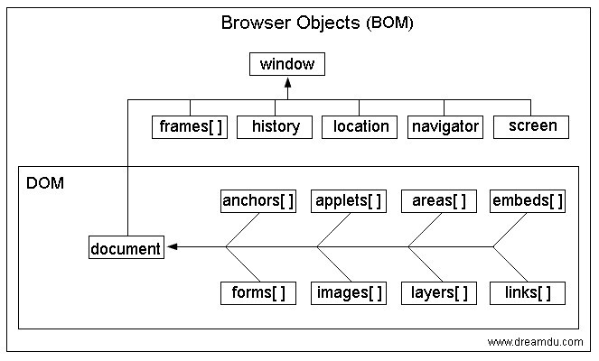

## [html] 有用过HTML5的webSQL和IndexedDB吗？说说你对它们的理解

  webSQL 和 IndexedDB 都是一种客户端的数据存储方案，webSQL已经废弃。IndexedDB 的特点是：存储空间大，使用异步存储数据模式，存放键值对型数据，支持数据库事务等，同时还可以存储多种类型数据，包括 js 对象类型。可以用在前端缓存大量数据。

  <a href="http://www.ruanyifeng.com/blog/2018/07/indexeddb.html" target="_blank">http://www.ruanyifeng.com/blog/2018/07/indexeddb.html</a>

## [css] 怎样把一个div居中？怎样把一个浮动元素居中？怎样把绝对定位的div居中？

  主要用到:

  flex
  text-align: center;
  margin: 0 auto;
  position: relative | absolute; left: 50%;
  vertical-align: middle;
  transform: translate(-50%);

## [js] 写一个方法获取图片的原始宽高

  通过new Image() 实例对象的naturalWidth 和 naturalHeight

  H5中img标签新增了两个属性naturalWidth和naturalHeight可以获取图片的原始尺寸


## [软技能] 知道IPV6是什么吗？说说它和IPV4的区别是什么？

  ipv6增加了海量的网络地址，使物联网成为可能。ipv4提供的2的32次方的地址根本不够无数的家用设备使用。而2的128次方的地址可为飞速增加的物联网设备提供足够的地址。如今到来的5G时代，ipv6在底层上可谓功不可没。

  下一代ip协议，ipv4协议不久地址就会用完，采用ipv6后，可使用的地址数量将大大增加。


 
  测试图例
  


```javascript


  //手写

  window.onload = function () {
      let img = document.getElementById("img");
      console.log(img.naturalWidth)
      console.log(img.naturalHeight)
  }

  //实现
  function loadImageAsync(url) {
      return new Promise(function(resolve, reject) {
          var image = new Image();

          image.onload = function() {
              var obj = {
                  w: image.naturalWidth,
                  h: image.naturalHeight
              }
              resolve(obj);
          };

          image.onerror = function() {
              reject(new Error('Could not load image at ' + url));
          };
          image.src = url;
      });
  }

  loadImageAsync('../assets/img/default.png').then(res => {
      console.log('图片信息', res)
  })
  // demo

  /*
  indexedDB
  数据库：IDBDatabase 对象
  对象仓库：IDBObjectStore 对象
  索引： IDBIndex 对象
  事务： IDBTransaction 对象
  操作请求：IDBRequest 对象
  指针： IDBCursor 对象
  主键集合：IDBKeyRange 对象
  */

  var request = window.indexedDB.open('test');

  console.log(request)

  request.onsuccess = function (event) {

      db = request.result;

      console.log('数据库打开成功',db);

      var objectStore;
      if (!db.objectStoreNames.contains('person')) {
          // 主键是id，自增
          objectStore = db.createObjectStore('person', { keyPath: 'id', autoIncrement: true });

          // 新建索引，参数索引名称、索引所在的属性，unique是否包含重复的值
          objectStore.createIndex('name', 'name', { unique: false });
          objectStore.createIndex('email', 'email', { unique: true });
      }

      var r = db.transaction(['person'], 'readwrite')
          .objectStore('person')
          .add({ name: '测试', age: 38, email: 'test@example.com' });

      r.onsuccess = function (event) {
          console.log('数据写入成功');
      };

      r.onerror = function (event) {
          console.log('数据写入失败', event);
      }
  };


  //新建一张表，判断是否存在，然后新建
  request.onupgradeneeded = function (event) {
      db = event.target.result;
      var objectStore;
      if (!db.objectStoreNames.contains('person')) {
          // 主键是id，自增
          objectStore = db.createObjectStore('person', { keyPath: 'id',autoIncrement: true });

          // 新建索引，参数索引名称、索引所在的属性，unique是否包含重复的值
          objectStore.createIndex('name', 'name', { unique: false });
          objectStore.createIndex('email', 'email', { unique: true });
      }

      console.log('onupgradeneeded')
  }


  console.log(request)

```
