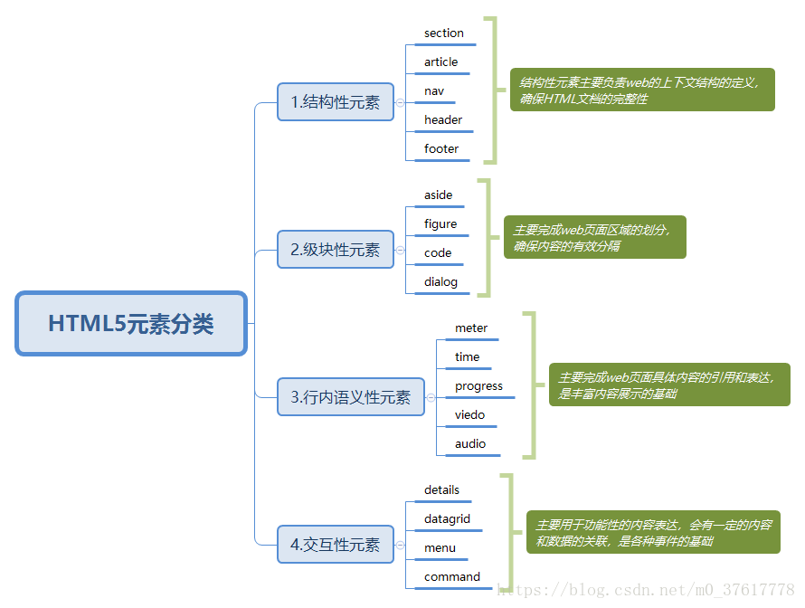

## [html] HTML5规范将元素分为哪几个大类？分别说说它们的特点



## [css] 举例说明伪类:nth-child、:first-child与:first-of-type这三者有什么不同？
```html
<div>
  <p>大儿子</p>
  <div>二儿子</div>
  <p>三儿子</p>
</div>
<p>二叔</p>
<div>三叔<div>
```
* div:nth-child（2） 选中父元素里的第二个子元素div；（即二儿子被选中）
* p:first-child 选中父元素里的第一个p元素；（大儿子被选中，二叔没有被选中，因为它不是父元素里的第一个元素）
* p:first-of-type 选中第一个类型为p的子元素（大儿子、二叔被选中，因为大儿子是父元素div的第一个p元素，二叔是body的一个p元素）
* :nth-child（n）和：first-child 是强调父元素里的第n个xx子元素，首先是第n个，然后才是xx类型；：first-of-type 主要强调类型，即一个父元素里，无论我们想选中的那个元素前面有多少个同级元素，都不算，只要找到父元素里的第一个xx子元素就行。

## [js] 如何实现文件拖动上传？

利用 HTML5 的 drag & drop API 来实现。需要注意的是，必须要设置 dragover 事件，不然不会触发 drop 事件。

[示例](https://codepen.io/Konata9/pen/BaBzExe?editors=1011)

## [软技能] 你有开发过弹幕吗？知道它的原理吗？说说看

没有开发过，如果要我来开发的话我会这样做：

* 在video上方设置一个弹幕container，设置相对定位。子元素都是绝对定位并设置z-index。
* 生成一个dom将弹幕内容填充进去，在container中append
* 设置dom的animation动画，从右到左划过整个video
* 将带有时间戳信息的弹幕内容通过规定好的格式发送给后端

PS：

* 顺序可以调换，一般是确定后台接收到数据了再生成dom
* 没了解过如何实现弹幕防挡。
* 弹幕出屏幕之后要销毁。
